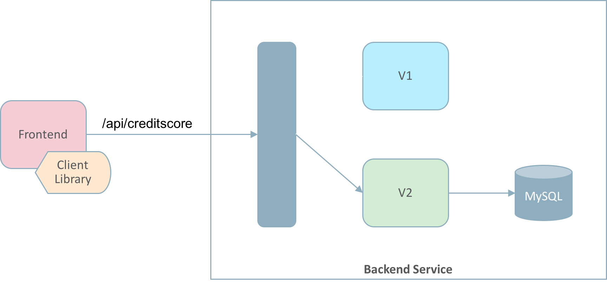
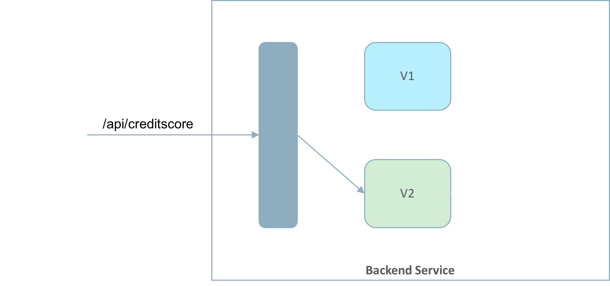
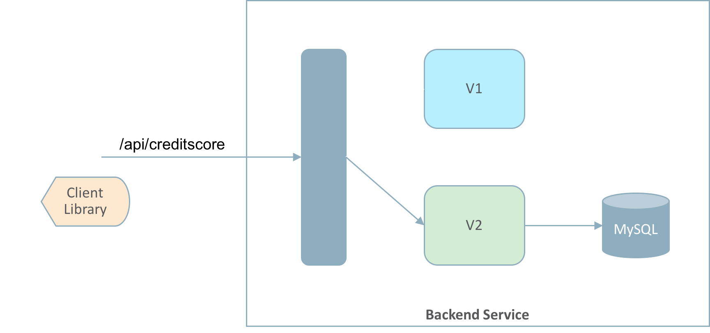

# Sample Microservices App - Aura JS Credit Score

## Introduction

This is a tutorial for microservices training. In this tutorial, we will cover the following features:

* Service Mesh - Deploy a microservice with Istio enabled
* Canary deployment - Switch traffic from version V1 to version V2
* Service Brokers - Provision and use a MySQL instance
* API-first development
* Observability - Observe the service runtime behaviour with Vizceral, Zipkin and Grafana (Limited)
* CI/CD - Use Wercker to deploy our services

## About the sample application
 
This is a simple node.js microservice application that exposes a REST API.

REST API GET "/api/creditscore" - This only returns a hardcoded message for now. We will enhance this API in this tutorial

In this tutorial, we will develop two versions of this service V1 and V2: 
* Version V1 is standalone app and doesn't use any DB
* In version V2 we will extend the app to connect to MySQL DB provisioned using Service Brokers 

**End State: **

## Prerequisites

- GitHub account
- Full access to CNP end-to-end (pipelines > releases > clusters)
- OCI LB quota. Should have room to create at least 1 LB for Istio ingress controller - this is a pre-requisite to install Aura which in turn installs Istio
- OKE 1.8.0 cluster with Aura platform pre-installed (if Aura is not pre-installed follow these [installation steps](https://confluence.oraclecorp.com/confluence/display/AURA/Installation+Steps+on+OKE+1.8.0))
- kubeconfig file of your OKE cluster downloaded on your machine
- kubectl installed and working on your machine 
- "kubectl proxy" runs and you can access the K8s dashboard
- Can view resources in your OCI tenancy (Ashburn region) from the OCI console
- Sufficient OCI block volume storage. At least 100 GB of block volume available to provision the service broker instance (uses 50 GB)
- (OPTIONAL) istioctl installed and working on your machine

## Tutorial Flow

In this tutorial, we will go through the following flow:

* [Part 1 - Deploy your first microservice](deploy_microservice.md)
  * Deploy microservice version V1 with Istio enabled (using Wercker)
	
  * Access GET "/api/creditscore" (in a Browser or in Postman)
  * Observe the microservice behaviour (in Vizceral, Zipkin, Grafana)

* [Part 2 - Canary deployment](canary_deploy.md)
  * Deploy microservice version V2 with Istio enabled (using Wercker)
	
  * Access GET "/api/creditscore" (in a Browser or in Postman)
  * See the traffic distribution between versions V1 and V2
  * Route 100% traffic to microservice version V2
	
  * Observe the microservice behaviour (in Vizceral, Zipkin, Grafana)

* [Part 3 - Service broker integration](service_broker.md)
  * Provision a MySQL instance using Service Broker
  * Connection settings for the MySQL service broker instance
  * Write code to connect microservice version V2 to the MySQL instance
	
  * Access GET "/api/creditscore" (in a Browser or in Postman)
  * Observe the microservice behaviour (in Vizceral, Zipkin, Grafana)

* [Part 4 - API-first development exprience](api_first.md)
  * TBD - Associate API descriptor with the microservice (from the Admin console)
  * TBD - Generate Javascript lib (from the Admin console)
	
  * TBD - Create a new client microservice to use the generated JS library to access the backend rest API
  * TBD - Deploy this new client microservice with Istio enabled (using Wercker)
	
  * TBD - Access the new client microservice
  * TBD - Observe the microservice behaviour (in Vizceral, Zipkin, Grafana)

## Cleanup 

* MySQL Service Broker: Go to [Admin console > Service Brokers](http://127.0.0.1:8001/api/v1/namespaces/default/services/aura-admin-service:admin-service/proxy/console/#/serviceBrokers) > thirdparty-mysql-service > Delete "mysql-sb-inst-1" service instance

* Clean up the entire lab

	curl -LSs https://raw.githubusercontent.com/sachin-pikle/aura-js-creditscore-v2/master/cleanup.sh | sh

	Ignore the following errors  
	"./cleanup.sh: line 5: oms: command not found"  
	"./cleanup.sh: line 11: istioctl: command not found"
