# Part 2 - Canary deployment

## Tutorial Flow

In this tutorial, we will go through the following flow:

* Deploy microservice version V2 with Istio enabled (using Wercker)
* Access GET "/api/creditscore" (in Browser/Postman) and observe the requests distributed between versions V1 and V2
* Route 100% traffic to microservice version V2
* Observe the microservice behaviour (in Vizceral, Zipkin, Grafana)

## Steps

### Deploy microservice version V2 with Istio enabled (using Wercker)

1. Set up the source code repo

	We will use an existing application for this tutorial.

	1.1. Sign in to [GitHub](https://github.com)

	1.2. Go to Sachin's GitHub repo V2 [aura-js-creditscore-v2](https://github.com/sachin-pikle/aura-js-creditscore-v2) and fork it. You now have your own working copy of the repo version V2

2. Set up the wercker CI/CD

	2.1. Sign in to [Wercker](https://app.wercker.com)

	2.2. Add a new application for V2 > aura-js-creditscore-v2

	2.3. Review the wercker.yml file. Note the following differences as we use Istio side cars alongside our microservice
	
	**a) kubectl step with embedded istioctl command for istio side car injection (manual)**
	
	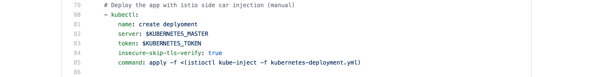
	
	**b) workaround since wercker doesn't support embedded istioctl commands**
	
	

	2.4. Set up push-to-CR and deploy-to-CE pipelines
	
	**a) Pipeline: Create push-to-CR pipeline**
	
	
	
	**b) Pipeline: Create deploy-to-CE pipeline with environment variables**
	
	
	
	**c) List of all your pipelines:**
	
	

	2.5. Set up the workflow
	
	**a) Workflow: Add push-to-CR pipeline**
	
	
	
	**b) Workflow: Add deploy-to-CE pipeline**
	
	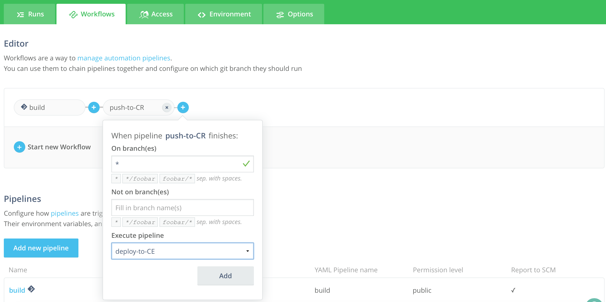
	
	**c) List of all your workflows:**
	
	

3. Deploy the app using wercker CI/CD

	3.1. Edit V2 > aura-js-creditscore-v2/routes/creditscore.js

	3.2. Look for the following line and make the requested changes
	
		// _CHANGE_ : Please comment the line with the DUMMY message and uncomment the one with the Welcome message

	3.3. Commit the change

	3.4. Wercker will fire a workflow run for V2. Check the progress on Wercker Pipelines > Runs

	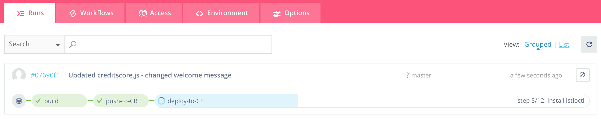
	
	3.5. Check Releases to confirm the new container image has been uploaded

	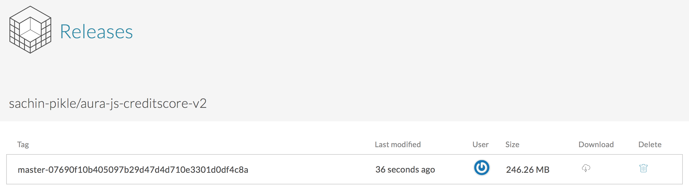
	
	3.6. Check the Kubernetes dashboard to see if the latest version got deployed. Note: When re-deploying it takes ~35 seconds for K8s to terminate the old pods and start the new pod

	
	
		
	3.7. Check the pod logs

	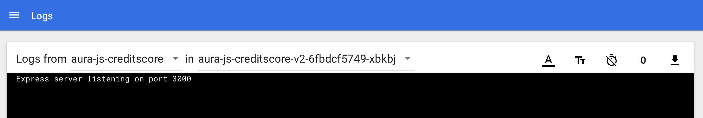
	

### Access GET "/api/creditscore" (in Browser/Postman) and observe the requests distributed between versions V1 and V2

1. Access GET /api/creditscore in a browser and you should see the following Welcome message. For now you will notice some requests are served by V1 and others by V2 because we have both versions running side-by-side. In the next step we will route 100% of the traffic to V2

		{ "MESSAGE": "Welcome to aura-js-creditscore version V2" }

		{ "MESSAGE": "Welcome to aura-js-creditscore version V1" }

2. (OPTIONAL) Access GET /api/creditscore in Postman and you should see the same Welcome message. For now you will notice some requests are served by V1 and others by V2 because we have both versions running side-by-side. In the next step we will route 100% of the traffic to V2

		{  
		    "MESSAGE": "Welcome to aura-js-creditscore version V2"  
		}

		{  
		    "MESSAGE": "Welcome to aura-js-creditscore version V1"  
		}

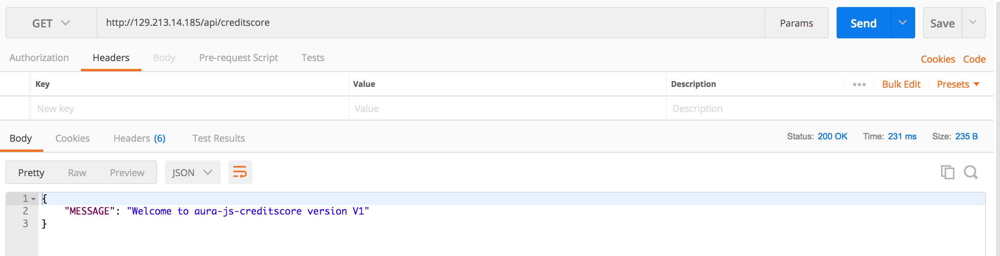

### Route 100% traffic to microservice version V2

1. In this step we will do a canary release and route 100% of the traffic to V2. This is done using the istioctl routes rules feature. Go to the wercker.yml file. Uncomment and use the "add" step to add your first route rule. Also you don't need to redeploy the app so comment out the "deploy" step.

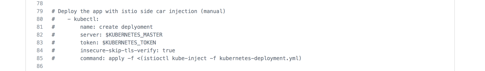

2. This will trigger a wercker run and add the routing rule. Now we should have 100% of the traffic routed to V2. Check the wercker runs > deploy-to-CE pipeline > "Add traffic route rule with istioctl" step logs to see the route rules set up.

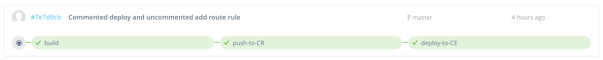

3. Once you successfully add a route rule, comment the "add" step. If you wish to change an existing routing rule, uncomment and use the "replace" step.

4. Access GET /api/creditscore in a browser multiple times and you should see the following Welcome message from V2. Now we have 100% of the traffic routed to V2

		{ "MESSAGE": "Welcome to aura-js-creditscore version V2" }

5. (OPTIONAL) Access GET /api/creditscore in Postman multiple times and you should see the same Welcome message from V2. Now we have 100% of the traffic routed to V2

		{  
		    "MESSAGE": "Welcome to aura-js-creditscore version V2"  
		}

### Observe the microservice behaviour (in Vizceral, Zipkin, Grafana)

1. Check the pod logs

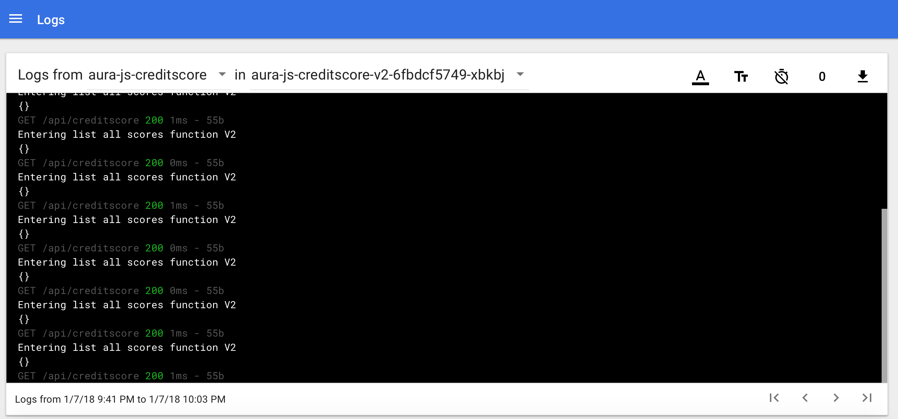

2. Access Vizceral console (Limited visibility for now, more on the roadmap)

Known Issue: Screen shows the data flowing for ~1 minute. This view doesn't refresh automatically and must be refreshed manually by reloading the top level console

URL: http://127.0.0.1:8001/api/v1/namespaces/default/services/aura-admin-service:admin-service/proxy/console/#/vizceral

**a) Vizceral Console Top Level**

You will see traffic flowing from the internet in to your cluster. Note the service "aura-js-creditscore" pod is deployed in a single AD.

**b) Vizceral Console Next Level Drill Down**

Click on the circle next to "My Cluster". And you will see traffic flowing from the internet into your "aura-js-creditscore" service.

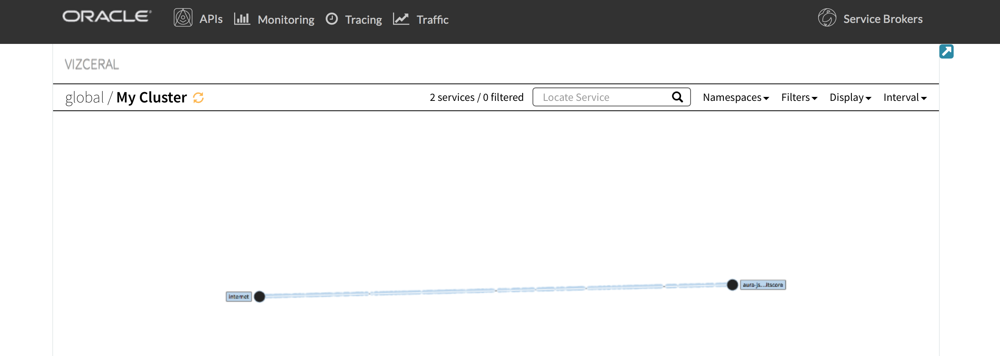

**b) Vizceral Console Service Details**

Click on the service circle named "aura-js-creditscore". And you will see additional details about your running aura-js-creditscore service

3. Access Grafana dashboard (Limited visibility for now, more on the roadmap)

URL: http://127.0.0.1:8001/api/v1/namespaces/default/services/aura-admin-service:admin-service/proxy/console/#/grafana

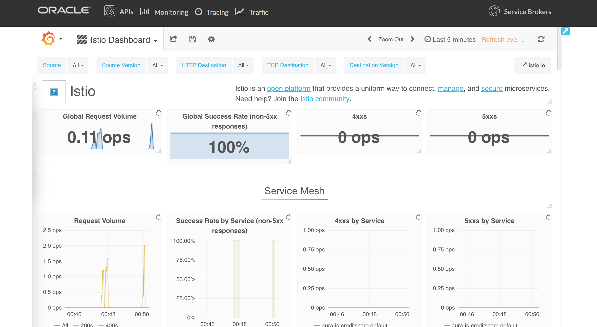

4. Access Zipkin tracing (Limited visibility for now, more on the roadmap)

URL: http://127.0.0.1:8001/api/v1/namespaces/default/services/aura-admin-service:admin-service/proxy/console/#/zipkin

Find the last 10, sort by Newest first.

**a) Zipkin Tracing Top Level**

**b) Zipkin Tracing Second Level**

Explore trace by clicking on the first span

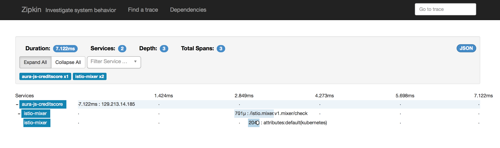

**c) Zipkin Tracing Additional Details**

Get additional trace details by clicking on the first line of the span "aura-js-creditscore"

