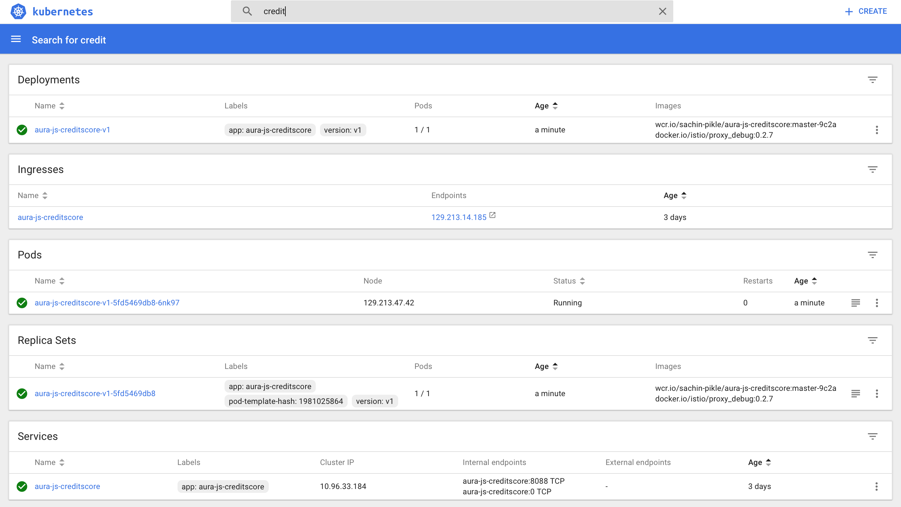
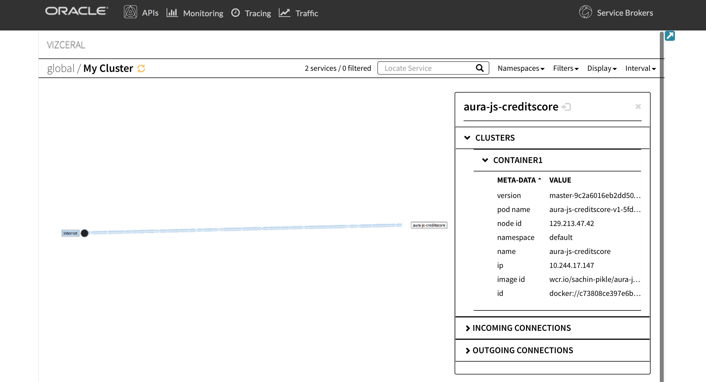

# Part 1 - Deploy your first microservice

## Tutorial Flow

In this tutorial, we will go through the following flow:

* Deploy microservice version V1 with Istio enabled (using Wercker)
  
* Access GET "/api/creditscore" (in a Browser or in Postman)
* Observe the microservice behaviour (in Vizceral, Zipkin, Grafana)

## Steps

### Deploy microservice version V1 with Istio enabled (using Wercker)

1. Set up the source code repo

    We will use an existing application for this tutorial.

    1.1. Sign in to [GitHub](https://github.com)

    1.2. Go to Sachin's GitHub repo [aura-js-creditscore-v1](https://github.com/sachin-pikle/aura-js-creditscore-v1) and fork it. You now have your own working copy of the repo version V1

2. Set up the Wercker CI/CD

    2.1. Sign in to [Wercker](https://app.wercker.com)

    2.2. Click the **+ > Add application** button in the header of the page

    2.3. Pick **GitHub** as your SCM and click **Next**.

    2.4. From the list of repositories, pick the one you forked in step 1.2 and click **Next**.

    2.5. On the **Configure Access** page, go with the recommended option and click **Next**.

    2.6. Review the options you selected and click **Create** to create the app.

    2.7. In your forked repo, review the aura-js-creditscore-v1/wercker.yml file. Note the following differences as we use Istio side cars alongside our microservice

    **a) kubectl step with embedded istioctl command for istio side car injection (manual)**

    

    **b) workaround since wercker doesn't support embedded istioctl commands**

    

    ### Set up pipelines ("push-to-CR" and "deploy-to-CE")

    #### Set up pipeline for pushing to container registry ("push-to-CR")

    1.1. Go to the application you created and click on the **Workflows** tab.

    1.2. Click **Add new pipeline** button

    1.3. Name the pipeline **push-to-CR** and use **push-image-to-wcr** for YML pipeline name (note that this is defined in the wercker.yml file in your forked repo)

    1.4. Click **Create** to create the pipeline and you should end up with something similar as in the image below:

    

    #### Set up pipeline for pushing to container engine ("deploy-to-CE")

    1.1. Go to the application you created and click on the **Workflows** tab.

    1.2. Click **Add new pipeline** button

    1.3. Name the pipeline **deploy-to-CE** and use **deploy-app-to-oce** for YML pipeline name(note that this is defined in the wercker.yml file in your forked repo)

    1.4. Click **Create** to create the pipeline

    1.5. Add pipeline environment variables for the following:

        KUBERNETES_MASTER -- get this URL from your OKE Cluster details page. Don't forget to add the prefix "https://"
        KUBERNETES_TOKEN -- click your profile icon in top right -> Settings -> Personal Tokens and generate one
        KUBERNETES_CLUSTER_ID -- use your OKE Cluster's ID (for eaxmple, you can use the first part from the Kubernetes Master URL)
        NOTE: We have hardcoded DOCKER_EMAIL value in the wercker.yaml file so you don't need to provide it in env variables 

    1.6. Your pipeline should look similar to the image below:

    

    1.7. Click the **Workflows** tab again to list all your pipelines:

    

    ### Set up the workflow

    1.1. Click the (+) sign next to the build, pick the **push-to-CR** pipeline and click **Add**:

    

    1.2. Click the (+) sign next to the push-to-CR item and select **deploy-to-CE** pipeline and click \*Add\*\*:

    

    1.3. Your workflow should look like this:

    

3. Deploy the app using wercker CI/CD

    3.1. In your forked repo, open `aura-js-creditscore-v1/routes/creditscore.js`

    3.2. Look for the following line and make the requested changes

        // _CHANGE_ : Please comment the line with the DUMMY message and uncomment the one with the Welcome message

    3.3. Commit and push the change to your repo

    3.4. Wercker will fire a workflow run for your V1 commit. Check the progress on the Wercker site by clicking the **Runs** tab

    

    3.5. Click the **Releases** button in the top nav to confirm the new container image has been uploaded to the registry:

    

    3.6. Check the Kubernetes dashboard to see if the latest version got deployed. Note: When re-deploying it takes ~35 seconds for K8s to terminate the old pods and start the new pod

    

    3.7. Check the pod logs

    

### Access GET "/api/creditscore" (in a Browser or in Postman)

1. Get the public IP address from wercker > "aura-js-creditscore-v1" application > Runs > "deploy-to-CE" pipeline output > "get LoadBalancer public IP address" step

2. Access GET <public-ip-address>/api/creditscore in a browser and you should see the following Welcome message

        { "MESSAGE": "Welcome to aura-js-creditscore version V1" }

3. (OPTIONAL) Access GET /api/creditscore in Postman and you should see the same Welcome message

        {  
            "MESSAGE": "Welcome to aura-js-creditscore version V1"  
        }

### Observe the microservice behaviour (in Vizceral, Zipkin, Grafana)

1. Check the pod logs again to see the requests that are being logged

2. Access Vizceral console (Limited visibility for now, more on the roadmap)

Known Issue: Screen shows the data flowing for ~1 minute. This view doesn't refresh automatically and must be refreshed manually by reloading the top level console.

URL: http://127.0.0.1:8001/api/v1/namespaces/default/services/aura-admin-service:admin-service/proxy/console/#/vizceral

**a) Vizceral Console Top Level**

You will see traffic flowing from the internet in to your cluster. Note the service "aura-js-creditscore" pod is deployed in a single AD.

**b) Vizceral Console Next Level Drill Down**

Click on the circle next to "My Cluster". And you will see traffic flowing from the internet into your "aura-js-creditscore" service.

**b) Vizceral Console Service Details**

Click on the service circle named "aura-js-creditscore". And you will see additional details about your running aura-js-creditscore service

3. Access Grafana dashboard (Limited visibility for now, more on the roadmap)

URL: http://127.0.0.1:8001/api/v1/namespaces/default/services/aura-admin-service:admin-service/proxy/console/#/grafana

4. Access Zipkin tracing (Limited visibility for now, more on the roadmap)

URL: http://127.0.0.1:8001/api/v1/namespaces/default/services/aura-admin-service:admin-service/proxy/console/#/zipkin

Find the last 10, sort by Newest first.

**a) Zipkin Tracing Top Level**

**b) Zipkin Tracing Second Level**

Explore trace by clicking on the first span

**c) Zipkin Tracing Additional Details**

Get additional trace details by clicking on the first line of the span "aura-js-creditscore"

