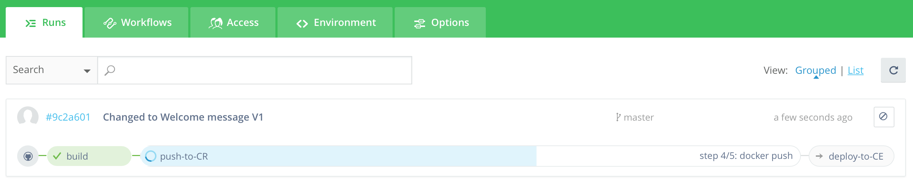
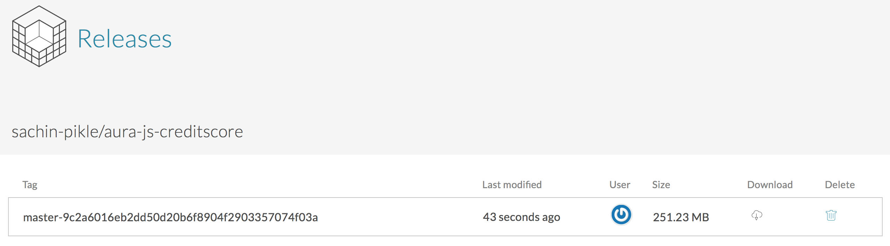
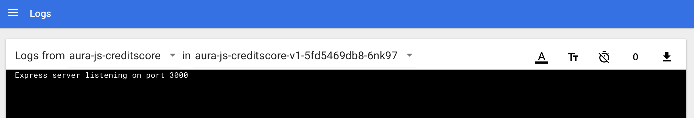
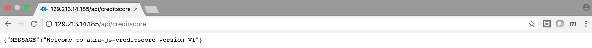

# Part 1 - Deploy your first microservice

## Tutorial Flow

In this tutorial, we will go through the following flow:

* Deploy microservice version V1 with Istio enabled (using Wercker)
* Access GET "/api/creditscore" (in a Browser or in Postman)
* Observe the microservice behaviour (in Vizceral, Zipkin, Grafana)

## Steps

### Deploy microservice version V1 with Istio enabled (using Wercker)

1. Set up the source code repo
	
	We will use an existing application for this tutorial.

	1.1. Sign in to [GitHub](https://github.com)

	1.2. Go to Sachin's GitHub repo [aura-js-creditscore](https://github.com/sachin-pikle/aura-js-creditscore) and fork it. You now have your own working copy of the repo version V1

2. Set up the Wercker CI/CD

	2.1. Sign in to [Wercker](https://app.wercker.com)

	2.2. Add application

	2.3. Review the [wercker.yml](../wercker.yml) file

	2.4. Set up push-to-CR and deploy-to-CE pipelines
	
	**a) Pipeline: Create push-to-CR pipeline**
	
	
	
	**b) Pipeline: Create deploy-to-CE pipeline with environment variables**
	
	
	
	**c) List of all your pipelines:**
	
	

	2.5. Set up the workflow
	
	**a) Workflow: Add push-to-CR pipeline**
	
	
	
	**b) Workflow: Add deploy-to-CE pipeline**
	
	
	
	**c) List of all your workflows:**
	
	

3. Deploy the app using wercker CI/CD

	3.1. Edit [V1 > aura-js-creditscore/routes/creditscore.js](../routes/creditscore.js)

	3.2. Look for the following line and make the requested changes
	
	`// _CHANGE_ : Please comment the line with the DUMMY message and uncomment the one with the Welcome message`

	3.3. Commit the change

	3.4. Wercker will fire a workflow run for V1. Check the progress on Wercker Pipelines > Runs

	
	
	3.5. Check Releases to confirm the new container image has been uploaded

	
	
	3.6. Check the Kubernetes dashboard to see if the latest version got deployed. Note: When re-deploying it takes ~35 seconds for K8s to terminate the old pods and start the new pod

	
	
	3.7. Check the pod logs

	
	

### Access GET "/api/creditscore" (in a Browser or in Postman)

1. Access GET /api/creditscore in a browser and you should see the following Welcome message

`{ "MESSAGE": "Welcome to aura-js-creditscore version V1" }`

2. (OPTIONAL) Access GET /api/creditscore in Postman and you should see the same Welcome message

`{  
    "MESSAGE": "Welcome to aura-js-creditscore version V1"  
}`

### Observe the microservice behaviour (in Vizceral, Zipkin, Grafana)

1. Check the pod logs

Add screenshot

2. Access Vizceral console (Limited for now)

Add screenshot

3. Access Grafana dashboard (Limited for now)

Add screenshot

4. Access Zipkin and Find the last 10, sort by Newest first (Limited for now)

Add screenshot

5. Explore trace (Limited for now)

Add screenshot
