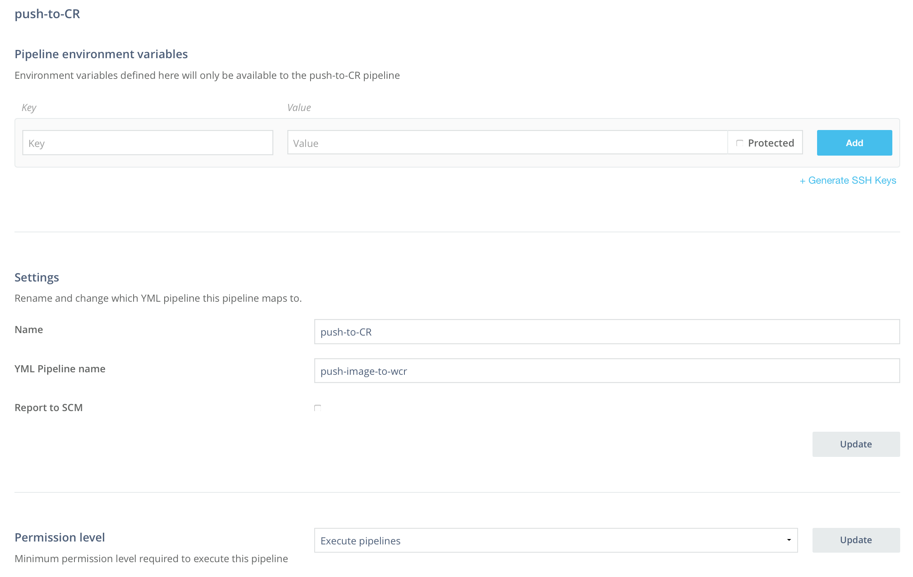
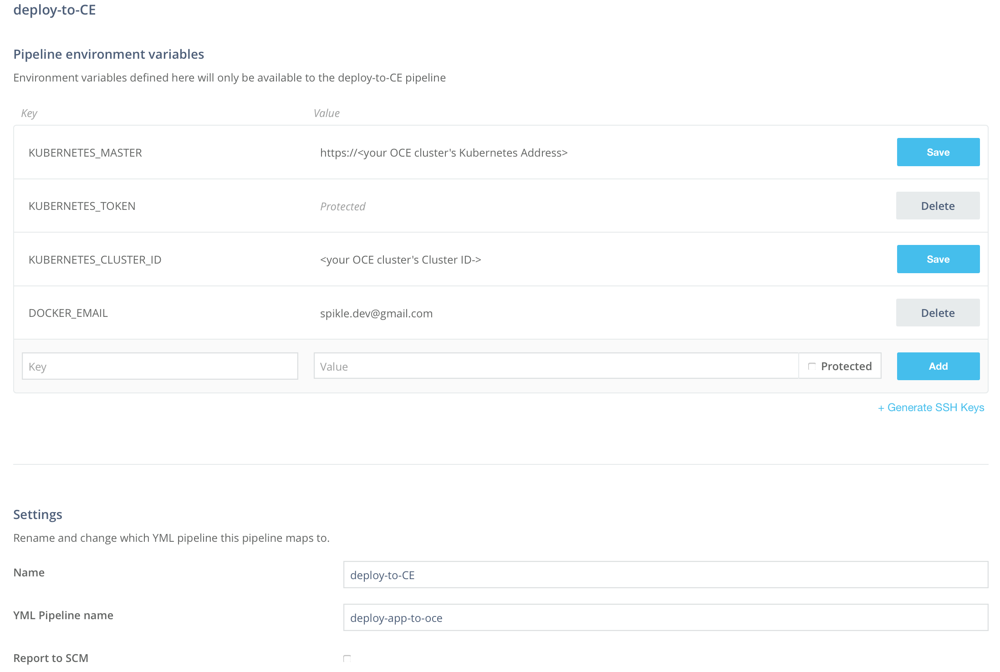
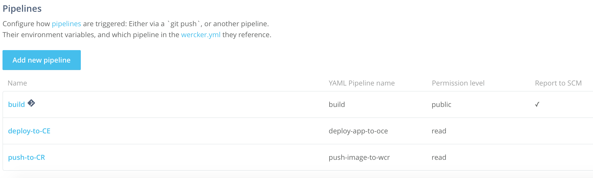
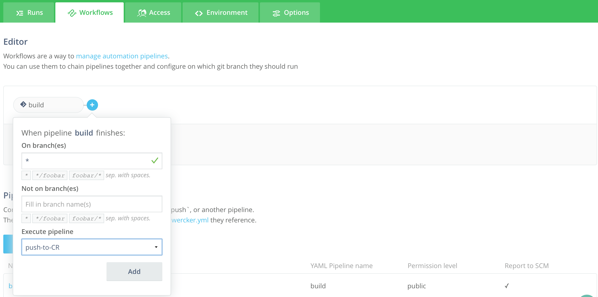
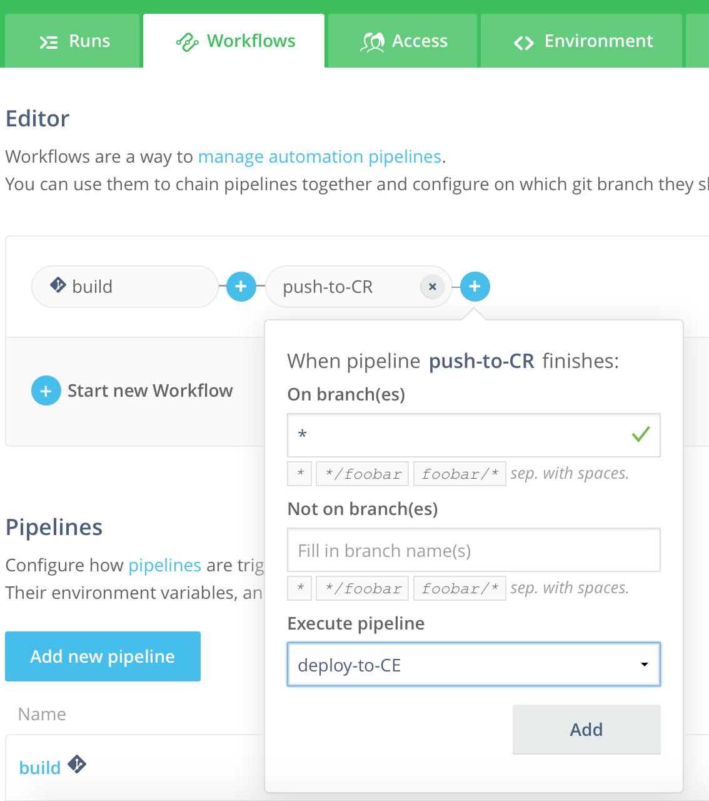
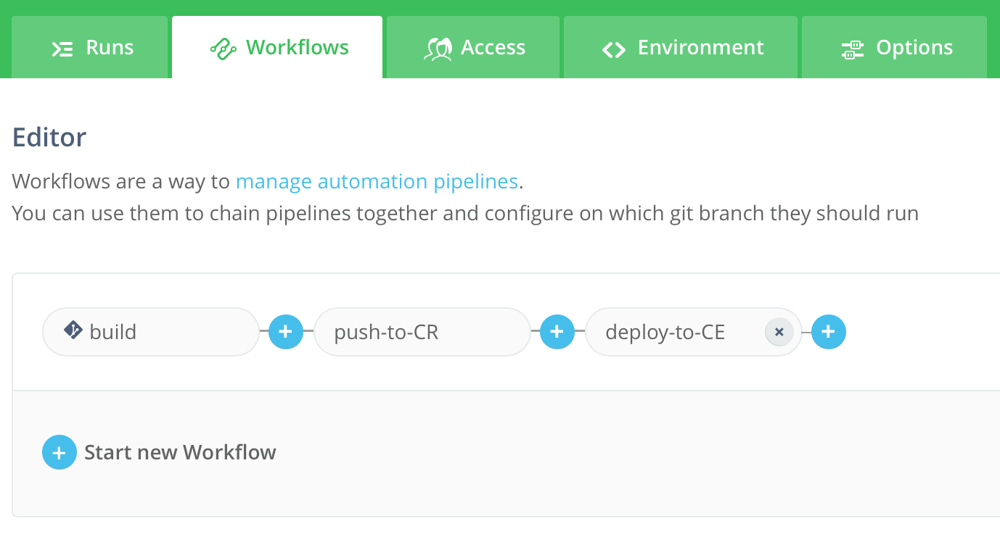

# Part 1 - Deploy your first microservice

## Tutorial Flow

In this tutorial, we will go through the following flow:

* Deploy microservice version V1 with Istio enabled (using Wercker)
* Access GET "/api/creditscore" (in a Browser or in Postman)
* Observe the microservice behaviour (in Vizceral, Zipkin, Grafana)

## Steps

### Deploy microservice version V1 with Istio enabled (using Wercker)

1. Set up the source code repo
	
	We will use an existing application for this tutorial.

	1.1. Sign in to [GitHub](https://github.com)

	1.2. Go to Sachin's GitHub repo [aura-js-creditscore](https://github.com/sachin-pikle/aura-js-creditscore) and fork it. You now have your own working copy of the repo version V1

2. Set up the Wercker CI/CD

	2.1. Sign in to [Wercker](https://app.wercker.com)

	2.2. Add application

	2.3. Review the [wercker.yml](../wercker.yml) file

	2.4. Set up push-to-CR and deploy-to-CE pipelines
	
	
	
	
	
	

	2.5. Set up the workflow
	
	
	
	
	
	

3. Deploy the app using wercker CI/CD

	3.1. Go to [V1 > view.ejs]()

	3.2. Change title - add V1 

	3.3. Commit the change

	3.4. Wercker will fire the CI/CD workflow for V1. Check the progress on Wercker Pipelines > Runs.

	Add screenshot

	3.5. Check Releases to confirm the new container image has been uploaded

	Add screenshot

	3.6. Check the Kubernetes dashboard to see if the latest version got deployed. Takes ~35 seconds for K8s to terminate the old pods and start the new pod

	Add screenshot

	3.7. Check the pod logs

	Add screenshot

### Access GET "/api/creditscore" (in a Browser or in Postman)

1. Access GET /api/creditscore in a browser and see the response

Add screenshot

2. (OPTIONAL) Access GET /api/creditscore in Postman and see the response

Add screenshot

### Observe the microservice behaviour (in Vizceral, Zipkin, Grafana)

1. Check the pod logs

Add screenshot

2. Access Vizceral console (Limited for now)

Add screenshot

3. Access Grafana dashboard (Limited for now)

Add screenshot

4. Access Zipkin and Find the last 10, sort by Newest first (Limited for now)

Add screenshot

5. Explore trace (Limited for now)

Add screenshot
