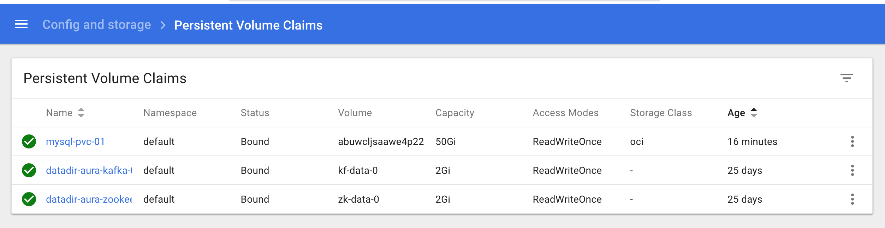
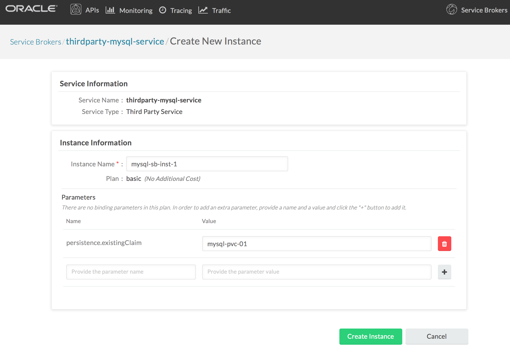
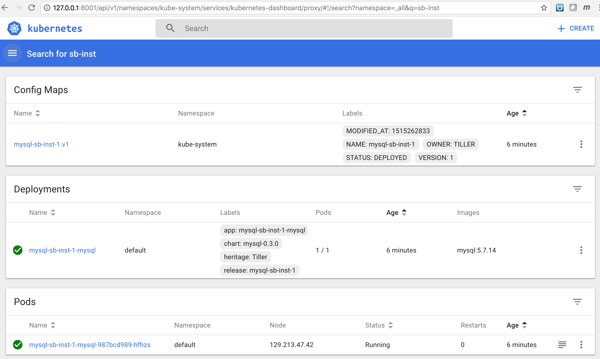
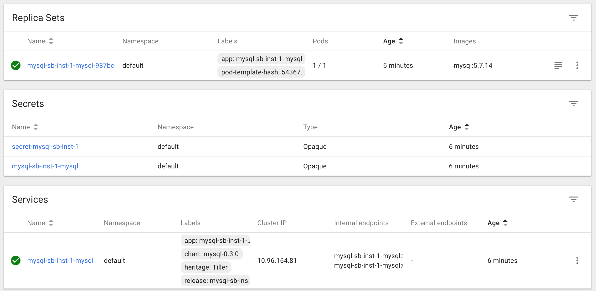

# Part 3 - Service broker integration

## Tutorial Flow

In this tutorial, we will go through the following flow:

* Provision a MySQL instance using Service Broker
* Write code to connect microservice version V2 to the MySQL instance
* Access GET "/api/creditscore" (in a Browser or in Postman)
* Observe the microservice behaviour (in Vizceral, Zipkin, Grafana)

## Steps

### Provision a MySQL instance using Service Broker

1. Provision a Persistent Volume Claim (PVC) / Persistent Volume (PV) / OCI Block Volume using aura-js-creditscore-v2 > mysql-pvc.yaml. 

    $ kubectl apply -f mysql-pvc.yaml  
    persistentvolumeclaim "mysql-pvc-01" created

2. Check the PVC from the Kubernetes Dashboard

3. Check the PV from the Kubernetes Dashboard

4. Check the Block Volume from the OCI console

5. Check the Volume Provisioner logs 

6. Go to Admin console > Service Brokers

URL: http://127.0.0.1:8001/api/v1/namespaces/default/services/aura-admin-service:admin-service/proxy/console/#/serviceBrokers 

7. Select MySQL (thirdparty-mysql-service)

8. Create New Instance of the MySQL service broker with the following values

Instance Name: mysql-sb-inst-1

Plan: basic

Parameters: 

Name: persistence.existingClaim

Value: mysql-pvc-01  ... This is the name of the PVC we created above

9. MySQL service broker instance created 

10. Service Brokers home page

11. Search "sb-inst" from the K8s dashboard

12. OCI Dashboard you will see the block volume attached to an OCI instance

### Write code to connect microservice version V2 to the MySQL instance

1. Go to [V2 > creditscore.js]()

2. Uncomment code to connect to MYSQL

3. Commit the change

4. Wercker will fire the CI/CD workflow for V2. Check the progress on Wercker Pipelines > Runs.

Add screenshot

5. Check Releases to confirm the new container image has been uploaded

Add screenshot

6. Check the Kubernetes dashboard to see if the latest version got deployed. Takes ~35 seconds for K8s to terminate the old pods and start the new pod

Add screenshot

7. Check the pod logs

Add screenshot

### Access GET "/api/creditscore" (in a Browser or in Postman)

1. Access GET /api/creditscore in a browser and see the response

Add screenshot

2. (OPTIONAL) Access GET /api/creditscore in Postman and see the response

Add screenshot

### Observe the microservice behaviour (in Vizceral, Zipkin, Grafana)

1. Check the pod logs

Add screenshot

2. Access Vizceral console (Limited for now - e.g. MySQL not visible currently, on the roadmap)

Add screenshot

3. Access Grafana dashboard (Limited for now - e.g. MySQL not visible currently, on the roadmap)

Add screenshot

4. Access Zipkin and Find the last 10, sort by Newest first (Limited for now - e.g. MySQL not visible currently, on the roadmap)

Add screenshot

5. Explore trace (Limited for now - e.g. MySQL not visible currently, on the roadmap)

Add screenshot

